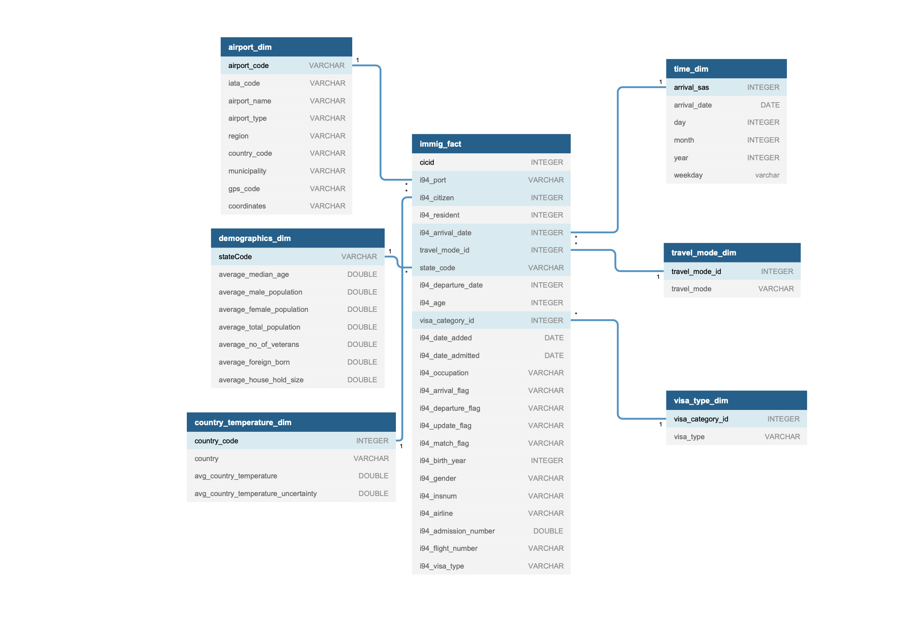

# Summary

This project process the I94 Immigration Data, World Temperature Data, U.S. City Demographic Data, Airport Code datasets to understand the following.

1. Number of Immigrants arrival for given airport for a given month.
2. Different immigrants residential country average temperature 
3. Immigrants on arrival state address average population etc...

# Step 1:  Scope the Project and Gather Data
## Scope 
#### Project Plan/Data Sets:
Planning to import immigration, temperature, demographics and airport code datasets provided by udacity to understand the number of immigrants arrival by the given airport for the given month and also using the temperature data sets to predict the immigrants country of citizenship average temperature data and also using demographics data to predict the average population in the state they are going to reside in.
       
#### End Solution:
In this project airflow is used to build the data pipeline. For handling different datasets, I have used Spark to process the different data sets in memory and the processed output is written into Parquet format in S3. Redshift is used to load the data for validation and also further required analysis can be performed in Redshift database itself. 
   
#### Different Tools :
    1. Airflow 
    2. S3
    3. Spark/EMR
    4. Redshift

## Describe and Gather Data 
#### Data sets
1. I94 Immigration Data: This data comes from the US National Tourism and Trade Office. It includes U.S. immigrant details for the year 2016.               
        
2. World Temperature Data: This dataset came from Kaggle. It includes the temperature data of different city from different countries.
        
3. U.S. City Demographic Data: This data comes from OpenSoft. This dataset contains information about the demographics of all US cities and census-designated places with a population greater or equal to 65,000. 
        
4. Airport Code Table: This is a simple table of airport codes and corresponding cities.

# Step 2: Explore and Assess the Data
#### Explore the Data 
Data quality issues and cleanup process for different datasets are documented below

##### Immigration Data:
Following data fields having floating 0 are converted to int
1. cicid 
2. i94mon
3. i94yr
4. i94cit
5. i94res
6. arrdate
7. i94mode
8. i94addr
9. depdate
10. i94bir
11. i94visa
12. biryear

Also, below fields are converted to appropriate data types as documented below

1. admnum converted to Double
2. fltno is converted to String
3. Visatype is converted to String.
    
i94mode field having null values are converted to 0.

##### Airport Data:

local_code/airport_code containing values are removed from the dataset to have a unique value set and also distinct local_code data is selected.

trim is applied for all the below data fields.

1. local_code
2. iata_code
3. name
4. type
5. iso_region
6. iso_country
7. municipality
8. gps_code

coordinates is converted to String

#### Temperature Data:

Temperature Data is merged with immigration data country code and the data is grouped by country to get the average temperature of the given country

#### U.S Demographics Data:

Race, count data fields are dropped to get the distinct records for a given city.

Demographics data is grouped by state code to get the state average male, female and total population of the given state.

# Step 3: Define the Data Model

#### Conceptual Data Model

Following data model is chosen to answer the project scope related questions.

In order to get the immigrants count by given airport and year need to combine the airport_dim, time_dim and immig_fact table we can query the total immigrants arrival for the given airport name for the given month.

In order to get different immigrants residential country average temperature we need to combine the immig_fact and country_temperature_dim

In order to get the immigrant arrival state address average population, need to combine immig_fact and demographics_dim by stateCode.

#### Mapping Out Data Pipelines

1. Create different etl for different data sets
2. Immigration etl breaks the data into following fact and dimension tables
    1. immig_fact
    2. time_dim for arrival date
    3. visa_type_dim
    4. travel_mode_dim
3. Airport etl retrieves all distinct airport code along with airport name etc..
4. Temperature etl retrieves all country average temperature and average temperature uncertainity data
5. Demographics etl retrieves state average male, female and total population 
6. Different etl jobs loads the data into parquet format into an S3 bucket.
7. Data pipeline loads the S3 parquet files into the redshift database and all the data validations are performed in the redshift db.

# Step 4: Run Pipelines to Model the Data 

#### Create Data Model

Data model is created using the capstone_project_data_pipeline.py script in airflow and this pipeline performs the following

1. Copies the data from the s3 bucket into EMR (moving all etl script files to S3 is a manual process)
2. Using SparkSSHOperator connects with EMR which reads the input files from S3 process the data in memory for the different ETL's (immigration, airport, demographics, temperature etc..) and loads the output into Parquet files.
3. LoadParquetToRedshift operator loads all the data into redshift for data validation and further analysis

#### Data Quality Checks
Data quality checks is achieved part of the data pipeline by calling the DataQualityOperator class available in operator/data_quality.py which performs following data validations

1. Record count validation, if record count is less than 1 then the data quality validation is marked as failed in the pipeline
2. Executes column null validation for all the tables primary key column

#### Data Dictionary

Data dictionary for all fact and dimension tables are available in the file data_dictionary.xlsx

# Step 5: Complete Project Write Up

#### Rationale for the choice of tools and technologies for the project.
Airflow is chosen to run data pipeline with all the error handling in place on airflow makes it the best tool for executing the pipeline.
Spark/EMR is chosen to run all the mentioned ETL's. Spark is chosen to handle all the data in memory for processing and written in a specific parquet files
Redshift is chosen to load the data and perform validation and all the required analysis can be done in redshift db itself.

#### Propose how often the data should be updated and why.
Job can run once in a day to load all the immigration, any change in temperature, demographics and airport information

#### Write a description of how you would approach the problem differently under the following scenarios:
1. The data was increased by 100x.
    -  If data is increased by 100x, then we need to spin up a big spark cluster to run the data in memory and loads the data into parquet files. S3 and other technology choice will still remain intact for the bigger data needs.
2. The data populates a dashboard that must be updated on a daily basis by 7am every day.
    - Monitoring the job execution time for the data and scheduling it appropriately before 7 am will load the data into redshift then the dashboard connecting to redhsift will have the latest data by 7 am everyday.
3. The database needed to be accessed by 100+ people.
    - Database access for all 100+ users can be given in redshift by creating different users and providing different permissions so that each user activity can be tracked in the redshift, providing a common user access to everyone will be harmful to track the activities.

# Project Execution

#### Executing local ETL scripts
Copy the Temperature Data and sas_data folder into data/input folder and run the individual ETL files from local

#### Executing Airflow pipeline script
In order to execute the pipeline script (capstone_project_data_pipeline.py) from Airflow follow the below steps

1. Download temperature (GlobalLandTemperaturesByCity.csv) data from [source](https://www.kaggle.com/berkeleyearth/climate-change-earth-surface-temperature-data) and copy it to the project data/input folder

2. Download sas_data in parquet format and copy the sas_data folder to the project data/input folder.

3. Copy the entire input folder into the S3 location and update all ETL (immigration_etl.py, airport_etl.py, temperature_etl.py, demographics_etl.py) files with the S3 input and output location path

4. Create EMR and redshift instance manually in region where the data files are available in S3

5. Create the following connections in airflow with Spark EMR and Redshift details
    1. emr_ssh_connection
             Conn Id: emr_ssh_connection
             Conn Type: SSH
             Host: EMR HOST address <eg: ec2-xx-xxx-xx-xxx.compute-1.amazonaws.com>
             username: xxxxx <eg. hadoop>
             password: <password for EMR>
             Extra: {
                "key_file": "spark-emr-cluster.pem",
                "timeout": "10",
                "compress": "false",
                "no_host_key_check": "true",
                "allow_host_key_change": "false"
            }
    2. redshift
            Conn Id: redshift
            Conn Type: Postgres
            Host: Resdhisft Host Address<eg. redshift-cluster-1.xxxxxxx.us-east-1.redshift.amazonaws.com>
            Schema: <Schema Name>
            Login: <Login User ID>
            Password: <Redshift Password>
            Port: 5439
6. Run the pipeline named capstone_project in airflow 

